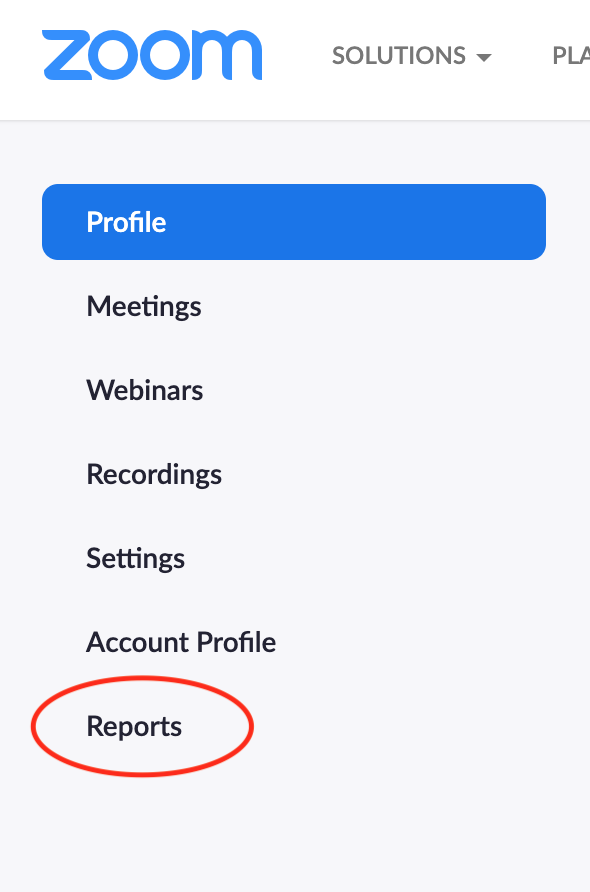
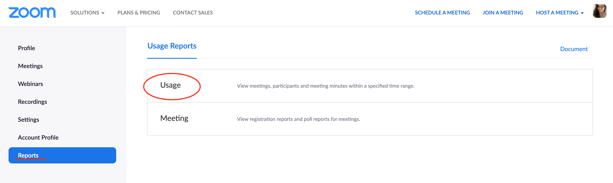
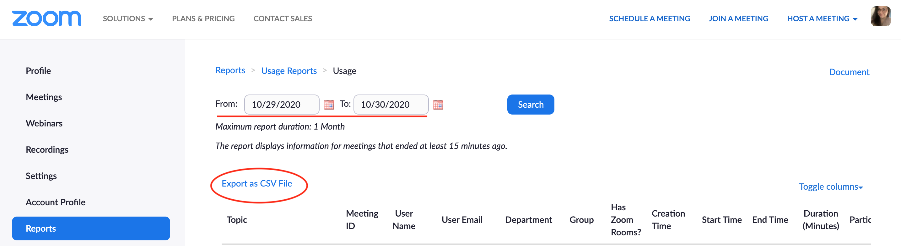

# zoom-attendance-tracker
A friendly bot that helps you keep track of who is in your zoom video chat and the duration they were in the meeting to easily take attendance.

# Understand 🔎

### The Problem 🤔
During my time teaching, I had to take attendance during zoom meetings. This can be time consuming and a bit confusing. I was also running into an issue of people coming into the lecture for the first 10 minutes or so just to get marked as present and then leaving. 

### The Solution 🤩
This tracker can help you easily keep track of your students and also the amount of time that they were in the meeting. No more being tricked into thinking that your students were in the lesson the whole time 👀

# How it works ⭐️
1. Generate a csv file from zoom when the meeting is over. Then follow these steps 👇

* Go to your zoom account and select "Reports" from the side panel.

* Once you are in the Reports section, you should see two options...Usage and Meeting, from here, please select "Usage."

* From here, you can now select the dates that the meeting took place and then click the "Export as CSV File" button.

